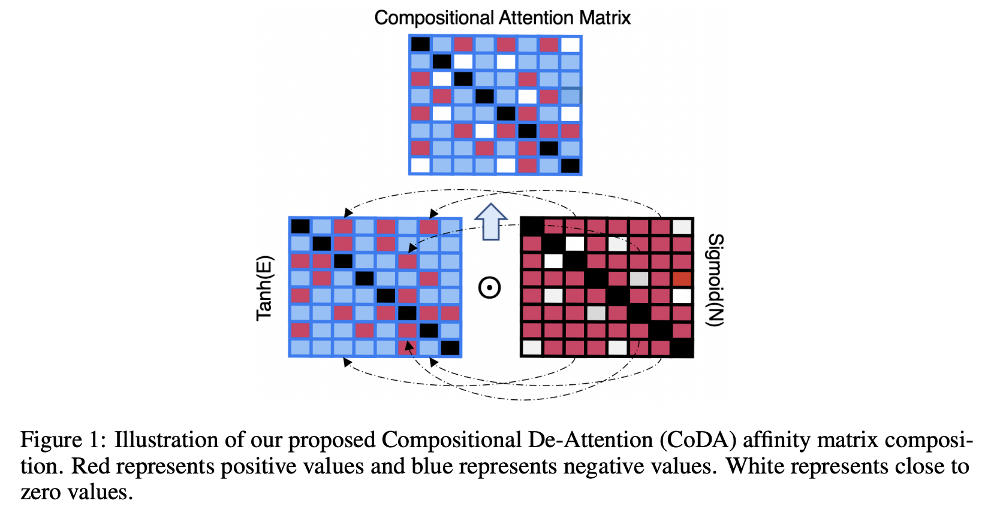

# Compositional De-Attention Networks
Paper: http://papers.nips.cc/paper/8845-compositional-de-attention-networks.pdf

Conference: NIPS 2019

Authors: Yi Tay, Anh Tuan Luu, Aston Zhang, Shuohang Wang, Siu Cheung Hui

## What is this paper about?

這一兩年來，Attention Mechanism在深度學習領域帶來了許多革新，其中在NLP任務中尤其明顯，許多pre-trained model如雨後春筍般而出。而這篇，從不同的角度切入Attention Mechanism，以不同於以往的方式，架構出創新的Attention機制！

以往的Attention Mechanism是與softmax密切掛鉤的，不過確實如此，講到Attention就想到用權重來對Tensor做加權，而作者認為，他們提出的Attention是compositional的，意謂著在學習的過程中，Tensor是可能被add, subtract or nullify。簡而言之，就是跳脫加權的想法，用另一種方式理解Attention。

## Tech Detail
兩個Input Sequence $A\in\R^{l_a \times d}$ $B\in\R^{l_b \times d}$，
$l_a, l_b$是seq的長度，d是input vector的維度，如果是self-attention，那麼這兩個seq相等。

本論文以兩個式子取代原本Attention使用的softmax貫穿全文

$$E_{ij}=\alpha F_E(a_i)F_E(b_j)^\top$$
$$N_{ij}=-\beta ||F_N(a_i)-F_N(b_j)||_{|l1}$$

$F_E(\cdot)$ $F_N(\cdot)$ 都是linear/nonlinear projection，$\alpha$ $\beta$都是超參數，$l1$是L1 Norm。

最終Attention Matrix為 
$$M=tanh(E)\odot sigmoid(N)$$
其中$tanh(E)$是負責上述提到的add, subtract，而$sigmoid(N)$則負起他閘門的功用，負責nullify tensor，可以理解為帶入一點hardmax的想法，不符合當前attention的我就不給權重，一點都不給。

首先有幾個細節

**Centering of N.** &nbsp; 因為N是由negative L1 distance構成，所以$sigmoid(N)\in [0,0.5]$，如此一來，sigmoid並沒辦法做到閘門的功用，所以要center N to zero mean：

$$N \to N-Mean(N) $$

理所當然的，暴力乘2

$$M=tanh(E)\odot (2*sigmoid(N))$$

也是一個解法，且實驗後效果不錯。

**Centering of E.** &nbsp; 同樣的，$tanh$也會需要 center zero mean，因為$tanh\in [-1,1]$。要達成可以add, subtract，需要有正負號存在，就需要center zero mean

論文中這張圖完美訴說這篇的核心

## What contributions does it make?

可以理解為，為了novelty，所以在attention上硬是不使用softmax而達成attention，又或者說以別種方式達到attention的精神，因為attention並不是定義說只能用softmax去架構。

## What are the main strengths?

以自己的方式去理解以及定義attention還可以怎麼做，跳脫出以往的加權方式，並且證明此創新想法是可行的，在許多任務上超越Transformer

## What are the main weaknesses?

1. 這篇的硬傷是，並沒有與原本的attention比較計算時間，計算上多做了L1 norm運算以及一層NN去建構$sigmoid(N)$，如果dimension過大的時候，多這層運算效能肯定會不好

2. $\alpha$ $\beta$這兩個超參數是否可以被取代，或是用train的？個人不是很喜歡模型中需要用超參數直接控制的情況，因為不夠客觀，而且更偏向試答案的感覺，在實際運用時難以衡量該怎麼決定超參數的值

## Scores

3/5
