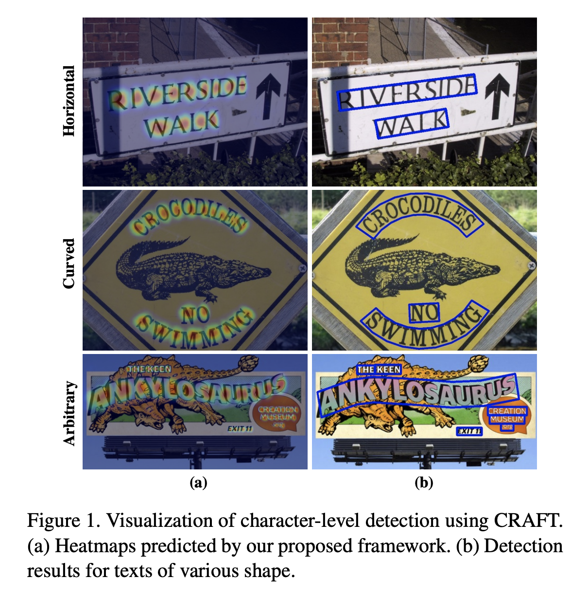
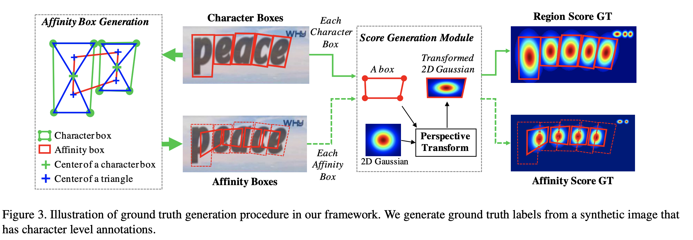

# Character Region Awareness for Text Detection

Paper: https://arxiv.org/pdf/1904.01941.pdf

Conference: CVPR 2019

Authors: Youngmin Baek, Bado Lee, Dongyoon Han, Sangdoo Yun, Hwalsuk Lee

## What is this paper about?
在text detection領域中，以前的方法在detection的時候習慣以word-level的bounding box框出文字，但這有一個局限性，就是當文字是以不規則方式排列時(如：廣告
看板、特別設計的logo...等等)，word-level bounding box在資料集上會難以標注，因為如此，也難以訓練。
所以這篇從更根本的方式去解決這個問題，直接從character-level去處理，只要能找到每個字元，再將它們合併成一個單字，不就完成了嗎。但該如何合併呢？這篇提出了 affinity score的概念，簡單來講就是看看相鄰兩個字元是否足夠有關係，我們可以在後處理中設一個threshold，來決定最後產生出來的bounding box符不符合我們的預期。這篇也告訴我們，以character-level的角度去切入，確實能處理現實生活場中文字是以不規則方式排列的情況。

## Tech Detail
(本篇略讀)

主要的目標有兩個，就是求得region score 和 affinity score，region score代表著這是不是一個character，affinity score則是表示兩兩相鄰字元是否能夠被認為是同一個word的一部分。

以這張圖來看應該很快就能理解，整個輸出的結果會有兩張heatmap，一張代表著character，越紅表示越可能是字元，另一張代表affinity，是在兩兩字元中間表示的，越紅表示兩個字元越有關聯

## What contributions does it make?
1. 解決在生活場景中不規則文字排列的偵測
2. 在缺少character-level資料的情況，提出一個合理的解決方式

## What are the main strengths?
1. 對於極度不規則的文字排列，有很好的偵測效果
2. 對於實驗設計的細節說明的很清楚
3. 因為是以character-level去train，在缺少資料集的情況之下，先以合成資料集訓練，再慢慢轉成現有資料集，其中提出的訓練方式是合理的
4. 在inference中，提供了足夠彈性的參數，讓使用者可以依自己的喜好決定bounding box的框法

## What are the main weaknesses?
1. 使用上，發現在低解析度的圖片上效果有限，或許處理低解析度的圖會是之後可以延伸的方向
2. 只是想抱怨，因為IP的關係沒提供訓練的code

## Scores
4.5/5