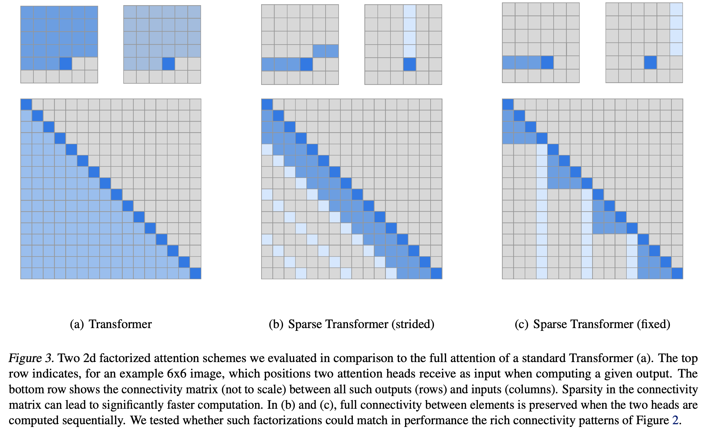
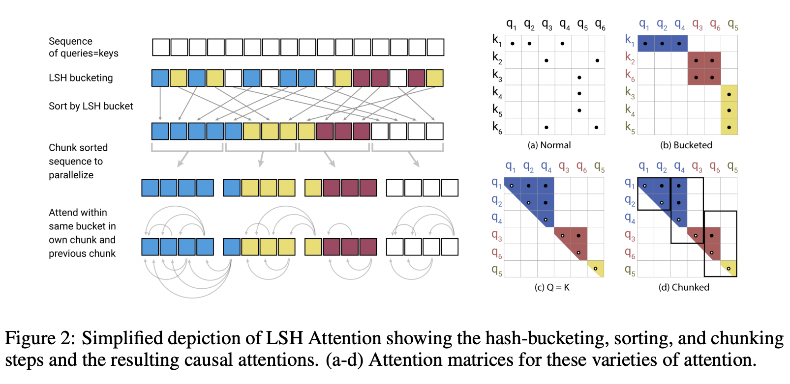
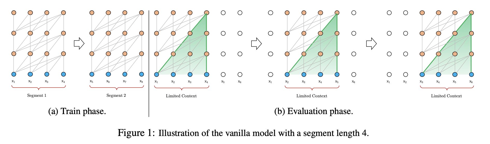
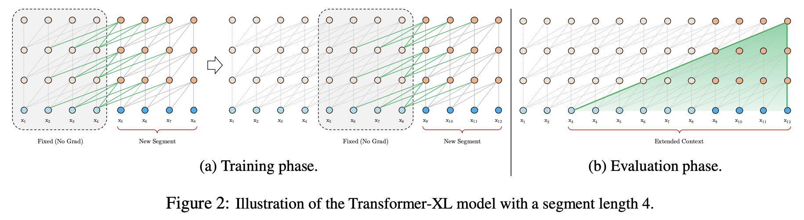
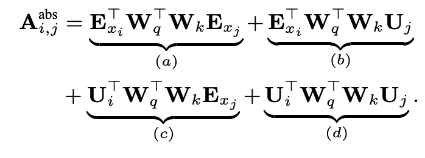
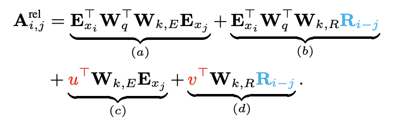
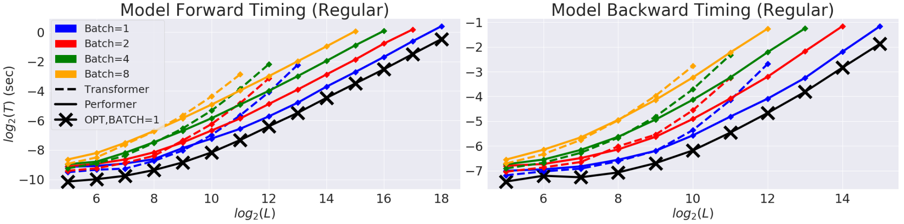
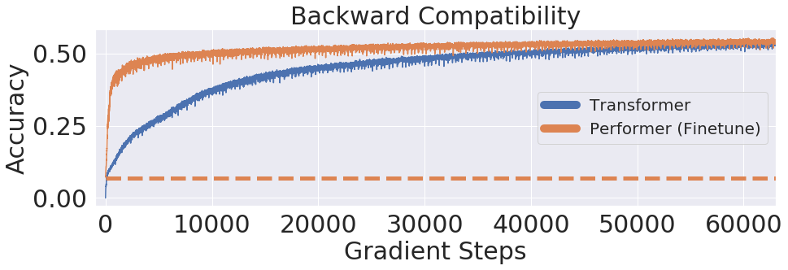
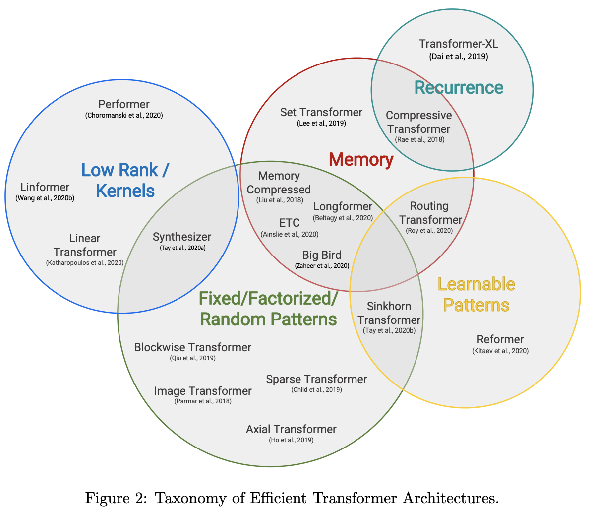
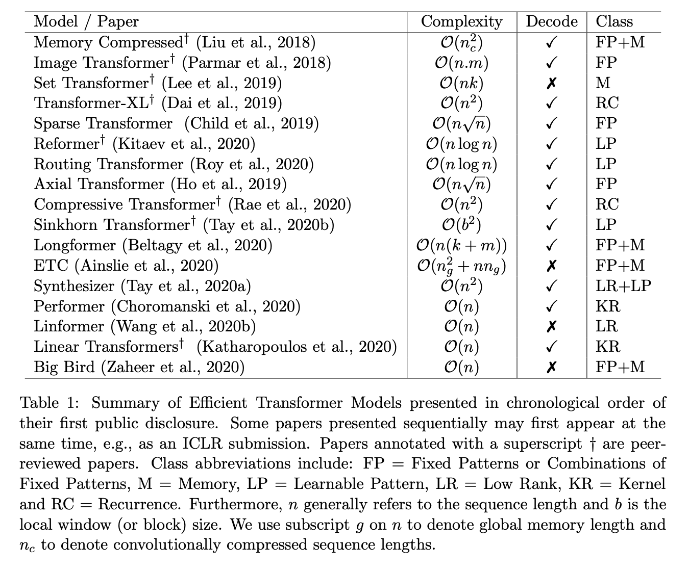

# A Survey of Transformers
本篇探討在vanilla transformer提出之後各種transformer的改進

## Vanilla Transformer

Vanilla Transformer是目前NLP領域中幾乎佔主導的深度學習基本網路架構(相對於LSTM, CNN而言)，各種pretrained model幾乎都是由Transformer所組成，即便Vanilla Transformer取得了許多成功，但為人詬病的點仍然很明顯，就是他的計算與空間複雜度，所以許多針對改進Vanilla Transformer的論文也不斷出現，而這些Transformers也同樣成為新的pretrained model的核心架構。

先來聊聊Vanilla Transformer的複雜度吧

首先self-attention的計算複雜度為 $O(hdn^2)$，$h$為attention的head數，$d$為query和key的維度，$n$為句子長度， dot-product 公式為
$$Attention(Q,K,V)=softmax(\frac{QK^T}{\sqrt{d_k}})V $$

由以上公式再乘上head數就可以推出計算複雜度。

同樣的空間複雜度也受到句子長度影響，為$O(hdn+hn^2)$，前者為存query和key所需的空間，後者為每個head產生的attention matrix。

我們以BERT-Base為例計算一下複雜度，BERT-Base句子長度為512，hidden size 768，12 heads，所以每個head維度為64 (768 / 12)。在這設定下，393216 floats(12 heads * 64 head size * 512 sequence length) = 393216 * 4 bytes = 1572864 bytes = 1572864/1024/1024 MB = 1.5 MB，1.5MB為query和key所需的空間。每個head產生的attention matrix所需空間為3145728 floats (12 * 512 * 512)～12MB，幾乎為前者的10倍大。BERT-Base為12層，所以每個example所需的memory接近(12+1.5)*12 = 162MB，當句子長度為1024時，$(12\times(1024^2)\times4/1024/1024+12\times64\times1024\times4/1024/1024)\times12 = 612$ MB，需要那麼多memory。

這也意味著在訓練時，我們只能用更小的batch size以及較差的平行運算能力，這也導致模型對長文本的推理能力較差。

---

## Sparse Transformers

Generating Long Sequences with Sparse Transformers

Paper: https://arxiv.org/pdf/1904.10509.pdf

Authors: Rewon Child, Scott Gray, Alec Radford, Ilya Sutskever 

這篇是OpenAI在2019年提出的新的transformer架構，其目的就是為了解決Vanilla Transformer的空間複雜度問題，將原本的$O(n^2)$降到$O(n\sqrt{n})$。

直接從圖簡單理解，b,c兩張圖是這篇paper提出的兩個方法，而想法為，不同於傳統的方法一次要跟所有token做attention，他們採用分組的方式，但組跟組之間也不是完全沒有關聯，淺藍色負責的就是整個sequence的attention。所以同一組之間的attention是強烈的，而長距離的attention可以透過加深神經網路的方式，讓相關的訊息互通，如此一來既能夠達到全局的attention也可以減少memory的使用。這樣的方法允許模型處理規模非常大的上下文。

有一個疑問是，既然全局的attention需要用層層疊加的，那麼效率上是否會有影響呢？但或許Vanilla Transformer詬病的就是空間複雜度的問題，長文本的運算cost非常高，這篇的想法就是將降低空間複雜度視為當務之急吧！

---

## Reformer: The Efficient Transformer

Paper: https://arxiv.org/abs/2001.04451

Conference: ICLR 2020

Authors: Nikita Kitaev, Łukasz Kaiser, Anselm Levskaya

上面提到說Vanilla Transformer能力雖強，但缺點也很明顯，就是在超長的文本中，需要花費太多的memory去存模型的參數，包含backpropagation中所需的參數。另外transformer的關鍵就是softmax，如果在超長文本中，長度為N，那麼模型每一步就要理解NxN對單詞之間的關係，非常不make sense。
而Reformer就是來解決上述提到的softmax和memory的問題，將 dot-product attention的計算複雜度降低，以及減少memory的使用，分別是兩個技術locality-sensitive hashing(LSH)以及Reversible Residual Network。實驗結果也證實了Reformer跟Transformer有同等的性能(這裡指準確率的指標)，且達到更好的記憶體使用效率以及對應更長文本能夠有效且快速地學習。

###  Locality-Sensitive Hashing Attention

參考論文 https://arxiv.org/pdf/1509.02897.pdf

在論文中先大概介紹了一下transformer中的Dot-product attention，並指出transformer中存在的弱點，其中一個討論很有趣，就是**Where do Q, K, V come from?**。我在理解transformer上對於為何要用QKV是這樣理解的，同一個tensor只是分別經過三個不同的線性轉換，轉成我們人類所定義的QKV，以符合Dot-product attention的公式。而在 LSH attention中，QK用同一個linear(即Q=K)，V用另一個，理解為QK的定義上更為相似，既然要省記憶體，那麼相似的事物共享同個神經網路也不為過吧。

#### Hashing Attention
在attention的公式中，$QK^T$的shape為[batch size, length, length]，但我們真正在意的是$softmax(QK^T)$，是softmax的結果，所以以更宏觀的角度來看，只要能達成softmax上想要表達的意義，那麼就不一定真的要去計算NxN對單詞的關聯。進一步的，我們把key分群(即把整個tensor拆成多段)，一個query就關注某一群跟當前query有關的K就好，而不是全部的keys。

#### Locality sensitive hashing
所以從上面的想法推廣出來，一個向量$x$透過hash $h(x)$將相似的向量放到同個hash-bucket

從上圖可以更快速理解，LSH透過計算hash func來實現這一點，該hash func將類似的向量配對在一起，而不是搜索所有可能的向量對。
不同的顏色表示不同的hash-bucket，相似的單詞有相同的顏色。當hash value被分配時，sequence會被重新排列，同個hash value會被分在同一塊，每一塊長度一樣，然後排序，可以平行計算。然後將attention放在這些更短的chunks(以及它們的相鄰塊有同個hash value)中，從而大大減少了計算複雜度。

LSH白話一點講就是，我們通過hash function映射變換操作，將原始資料集合分成了多個子集合，而每個子集合中的資料間是相鄰的且該子集合中的元素個數較小，因此將一個在超大集合內查找相鄰元素的問題轉化為了在一個很小的集合內查找相鄰元素的問題，顯然計算量下降了很多。

###  Reversible Transformer

這裡來解決記憶體使用的問題，在backpropagation中針對activation的存取做優化，如果可以不儲存activation(為了偏導用)，那麼可以減少GPU的使用。

#### Reversible Residual Network(RevNets)
RevNets就是當前層的activation結果可由下一層的結果計算得出，也就是如果我們知道網路最後一層的結果，就可以反推前面每一層的中間結果，這樣我們只需要存網路的參數和最後一層的結果即可，activation結果的儲存與網路的深度無關了，將大幅減少GPU的使用。

**也就是說，用計算的時間去解掉存記憶體的空間**
因為backpropagation中的activation要用後一層的結果去推算，省掉了存參數在GPU的空間，但增加了計算時間，但實際上這計算時間也不多啦

延伸閱讀： https://ameroyer.github.io/reading-notes/architectures/2019/05/07/the_reversible_residual_network.html

#### Chunking
FeedForward 那裡仍然使用了大量的記憶體，但FeedForward各個位置之間的關係是獨立的，所以可以分塊，同樣的，也是為了去減少記憶體的使用。

### Conclusion
總結來說，Reformer完全是針對Transformer在長文本中的弱項做了全面的補強，在記憶體優化上用了許多的巧思，而這個切入點也很實際，可能一般的訓練集還沒有很多超長上下文的文本，但真實世界中，長文本無處不在，這個架構更符合落地的應用。

---

## Transformer-XL

Paper: https://arxiv.org/pdf/1901.02860.pdf

Conference: ACL 2019

Authors: Zihang Dai, Zhilin Yang, Yiming Yang, Jaime Carbonell, Quoc V. Le, Ruslan Salakhutdinov

Transformer-XL是XLNet所使用的Transformer，也針對原本的transforemr做了改進。原本的transformer在長文本的表現上受限，只能使用固定長度的segments來處理長文本，又每個segments的處理都是獨立的，這是重點，因為是獨立的，所以先後segments彼此之間沒有關聯，即便他們是在同一段落。如果由我實際操作過的例子來講，在QA任務(squad格式的資料集)中，有一個stride參數，代表著如果輸入句子長度大於我設定的max_len，那麼第二段的起始結束位置會是[0+stride, max_len+stride]，也就是移動stride大小的長度當成下一段，但這下一段的資訊，跟前一段是沒有關聯的，在BERT QA中，假設輸入的文章要問的問題有10個，那麼第一段會問10個問題，第二段也是問同樣10個問題，即便這兩段閱讀上是有關聯的，而且問題是一模一樣的，但BERT會拆成兩段沒有關聯的文章當成input去訓練。

確實這樣的做法很不make sense，所以Transformer-XL主打的點就是當前segment是可以得到之前segment的訊息，也就是這篇所提出的segment-level recurrence mechanism，讓原先的Transformer具有recurrence的特性，而且因為recurrence的關係原先的絕對位置Encoding的方法不再適用，因此作者提出了relative positional encoding scheme解決了這個問題。

### Segment Recurrence

Formally, let the two consecutive segments of length $L$ be $s_τ = [x_{τ,1}, · · · , x_{τ,L}]$ and $s_{τ+1} = [x_{τ+1,1}, · · · , x_{τ+1,L}]$ respectively. Denoting the $n$-th layer hidden state sequence produced for the $τ$-th segment sτ by $h^n_τ ∈ R^{L×d}$, where d is the hidden dimension. Then, the $n$-th layer hidden state for segment $s_{τ+1}$ is produced (schematically) as follows,

$$
\mathrm{\widetilde{h}_{τ+1}^{n−1} = concat(StopGradient(h^{n-1}_{τ}), h^{n−1}_{τ+1})}\\
\mathrm{q^{n}_{τ+1} = h^{n−1}_{τ+1}W^T_q}\\
\mathrm{k^{n}_{τ+1} = \widetilde{h}^{n−1}_{τ+1}W^T_k}\\
\mathrm{v^{n}_{τ+1} = \widetilde{h}^{n−1}_{τ+1}W^T_v}\\
\mathrm{h^{n}_{τ+1}=Transformer{\text -} Layer(q^{n}_{τ+1}, k^{n}_{τ+1}, v^{n}_{τ+1})}
$$

​

Consequently, the largest possible dependency length grows linearly w.r.t. the number of layers as well as the segment length, i.e., $\mathrm{O(N × L)}$, as visualized by the shaded area in Fig. 2b.

簡單來說，當前segment在當前層數的hidden state是由前一層前一個segment以及前一層當前segment所得到的，所以層數越多，所累積的歷史訊息就更多。

假設N=640, L=16層，那麼Transformer-XL理論上可以得到10,240個token的訊息。

然後StopGradient是為了避免使用大量的記憶體，因為沒使用StopGradient的話在BP時會用到大量的記憶體。

### Relative Positional Encodings

既然把input切成段了，那麼位置的encoding也要改變，就要改成relative positional encoding

在這篇的實驗中，對於不同segment但同個位置的token，使用原本的Positional Encodings會造成模型分不出來這兩個不同的segment有什麼差別，也就是，我們還要提供不同的segment但同個index的差異性。

In the standard Transformer (Vaswani et al., 2017), the attention score between query $q_i$ and key vector $k_j$ within the same segment can be decomposed as

In the equation above, $E_{xi}$ is the content-based embedding of token at location $i$, and $U_j$ is the position embedding for token $j$.

a) relates the query's content with the key's content
b) relates the query's content with the key's position
c) relates the query's position with the key's content
d) relates the query's position with the key's position

而relative position encoding，作者調整了一些地方

在(b)和(d)中，$U_j$被取代成relative position counterpart $R_{i-j}$
$R$ is a sinusoid encoding matrix (Vaswani et al.,2017) without learnable parameters.

Separate the two weight matrices $W_{k,E}$,E​and $W_{k,R}$ ​for producing the content-based key vectors and location-based key vectors respectively.

Since the query vector is the same for all query positions, it suggests that the attentive bias towards different words should remain the same regardless of the query position. So we replace $U^T_iW^T_q$ T​with trainable parameters $u$ and $v$.

Under the new parameterization, each term has an intuitive meaning: term (a) represents content-based addressing, term (b) captures a content-dependent positional bias, term (c) governs a global content bias, and (d) encodes a global positional bias.

N-layer Transformer-XL:

$$
\mathrm{\widetilde{h}_{τ}^{n−1} = concat(StopGradient(h^{n-1}_{τ-1}), h^{n−1}_{τ})}\\
\mathrm{q^{n}_{τ} = h^{n−1}_{τ}W^T_q}\\
\mathrm{k^{n}_{τ} = \widetilde{h}^{n−1}_{τ}W^T_k}\\
\mathrm{v^{n}_{τ} = \widetilde{h}^{n−1}_{τ}W^T_v}\\
A_{τ,i,j}^{n}​={q_{τ,i}^{n}}^\top​ k_{τ,j}^{n​}+{q_{τ,i}^{n}}^\top ​W_{k,R}^{n​}R_{i−j​}+{u}^\top k_{τ,j}​+v^\top W_{k,R}^n​R_{i−j}​\\
a_τ^n​=Masked{\text -}Softmax(A_{τ,i,j}^{n​})v_τ^n\\
​o_τ^n​=LayerNorm(Linear(a_τ^n​)+h_τ^{n−1}​) \\
h_τ^n​=Positionwise{\text -}Feed{\text -}Forward(o_τ^n​)\\
$$

---

## Performer

Rethinking Attention with Performers

Paper: https://arxiv.org/pdf/2009.14794.pdf

Authors: Krzysztof Choromanski, Valerii Likhosherstov, David Dohan, Xingyou Song, Andreea Gane, Tamas Sarlos, Peter Hawkins, Jared Davis, Afroz Mohiuddin, Lukasz Kaiser, David Belanger, Lucy Colwell, Adrian Weller 

此篇略讀

本篇重點在於，將原本transforemr的空間複雜度$O(n^2)$降到線性的$O(n)$，而且理想情況下可以不用重新訓練模型，輸出結果也不會有明顯變化。方法是通過隨機投影將標準Attention的複雜度線性化。

首先之前的方法依賴於稀疏注意力(sparse attention)，sparse attention是從段落區塊而不是整個文本所有可能的pair中計算相似度分數，從而減少了計算的時間和注意力機制的memory需求，但也因此稀疏矩陣不是完整矩陣。而sparse attention最大的缺點就是他必須疊更多的attention layers去補償sparse attention的稀疏訊息表示，也因此他需要retraining還有更大量的cost去運算。還有一些應用不能使用sparse attention，像是推薦系統，因為我們必須精準的計算similarity scores。

而Performer就是為了避免這些問題，且加快訓練速度，同時允許模型處理更長的長度。來討論線性的Attention，我們先從Scaled-Dot Attention討論起

$$
Attention(\boldsymbol{Q},\boldsymbol{K},\boldsymbol{V}) = softmax\left(\boldsymbol{Q}\boldsymbol{K}^{\top}\right)\boldsymbol{V}
$$

$\boldsymbol{Q}, \boldsymbol{K}, \boldsymbol{V}\in\mathbb{R}^{n\times d}$

一般情況下，$n>d$甚至$n\gg d$ (BERT base $d=64$)。而造成空間複雜度是$O(n^2)$，從而制約Attention效能的關鍵因素，其實是Softmax。$\boldsymbol{Q}\boldsymbol{K}^{\top}$這一步我們得到一個$n×n$的矩陣，就是這一步決定了Attention的複雜度是$O(n^2)$。如果沒有Softmax，那麼就是三個矩陣連乘$\boldsymbol{Q}\boldsymbol{K}^{\top}\boldsymbol{V}$，而矩陣乘法是滿足結合率的，所以我們可以先算$\boldsymbol{K}^{\top}\boldsymbol{V}$，得到一個$d×d$的矩陣，然後再用$Q$乘它，由於$d \ll n$，所以這樣算大致的複雜度只是$O(n)$，也就是Q占主導整個複雜度。也就是說，去掉Softmax的Attention的複雜度可以降到最理想的線性級別$O(n)$。

問題來了，直接去掉Softmax還能算是Attention嗎？它還能有標準的Attention的效果嗎？為了回答這個問題，我們先將Scaled-Dot Attention的定義等價地改寫為
$$
Attention(\boldsymbol{Q},\boldsymbol{K},\boldsymbol{V})_i = \frac{\sum\limits_{j=1}^n e^{\boldsymbol{q}_i^{\top}\boldsymbol{k}_j}\boldsymbol{v}_j}{\sum\limits_{j=1}^n e^{\boldsymbol{q}_i^{\top}\boldsymbol{k}_j}}
$$

所以，Scaled-Dot Attention其實就是以$e^{\boldsymbol{q}_i^{\top}\boldsymbol{k}_j}$為權重對$v_j$做加權平均。所以我們可以提出一個Attention的一般化定義

$$
Attention(\boldsymbol{Q},\boldsymbol{K},\boldsymbol{V})_i = \frac{\sum\limits_{j=1}^n \text{sim}(\boldsymbol{q}_i, \boldsymbol{k}_j)\boldsymbol{v}_j}{\sum\limits_{j=1}^n \text{sim}(\boldsymbol{q}_i, \boldsymbol{k}_j)}
$$

也就是把$e^{\boldsymbol{q}_i^{\top}\boldsymbol{k}_j}$換成$\boldsymbol{q}_i, \boldsymbol{k}_j$的一般函數$\text{sim}(\boldsymbol{q}_i, \boldsymbol{k}_j)$，為了保留Attention相似的分佈特性，我們要求$\text{sim}(\boldsymbol{q}_i, \boldsymbol{k}_j)\geq 0$恆成立。也就是說，我們如果要定義新式的Attention，那麼要保留上面公式的形式，並且滿足$\text{sim}(\boldsymbol{q}_i, \boldsymbol{k}_j)\geq 0$。如果直接去掉Softmax，那麼就是$\text{sim}(\boldsymbol{q}_i, \boldsymbol{k}_j) = \boldsymbol{q}_i^{\top}\boldsymbol{k}_j$，問題是內積無法保證非負性，所以這還不是一個合理的選擇。

一個自然的想法是：如果$\boldsymbol{q}_i,\boldsymbol{k}_j$的每個元素都是非負的，那麼內積自然也就是非負的。為了完成這點，我們可以給$\boldsymbol{q}_i,\boldsymbol{k}_j$各自加個激活函數$\phi,\varphi$，即$\text{sim}(\boldsymbol{q}_i, \boldsymbol{k}_j) = \phi(\boldsymbol{q}_i)^{\top} \varphi(\boldsymbol{k}_j)$。其中$\phi(\cdot),\varphi(\cdot)$是值域非負的激活函數。

所以改成線性的Attention後，會變成
$$\left(\phi(\boldsymbol{Q})\varphi(\boldsymbol{K})^{\top}\right)\boldsymbol{V}=\phi(\boldsymbol{Q})\left(\varphi(\boldsymbol{K})^{\top}\boldsymbol{V}\right)
$$

上式左端的複雜度依然是$O(n^2)$，由於矩陣乘法滿足結合律，我們可以先算後面兩個矩陣的乘法，這樣複雜度就可以降為$O(n)$。

而Performer就是要尋找新的$\tilde{\boldsymbol{q}}, \tilde{\boldsymbol{k}}$，使得

$$\text{sim}(\boldsymbol{q}, \boldsymbol{k}) \approx \tilde{\boldsymbol{q}}\cdot\tilde{\boldsymbol{k}}$$

### Properties
直接來看結果

Bidirectional timing for the regular Transformer model in log-log plot with time (T) and length (L). Lines end at the limit of GPU memory. The black line (X) denotes the maximum possible memory compression and speedups when using a “dummy” attention block, which essentially bypasses attention calculations and demonstrates the maximum possible efficiency of the model. The Performer model is nearly able to reach this optimal performance in the attention component.
在長文本中，Perforemr比Transforemr來得有更多的優勢。

那能不能達到我們一開始的預期目標—不用重新訓練已訓練好的模型呢？很遺憾，不行，圖中顯示Performer直接load Transformer的權重不能恢復已有的結果，但經過finetune後可以迅速恢復回復。

一個疑問，Performer如何保證向後兼容，即如何用訓練好的Transformer去初始化Performer？

### Transformer分類圖

其中decode那一欄指的是能否mask掉未來的訊息，用於語言模型
圖片來源：https://arxiv.org/pdf/2009.06732.pdf

參考資料：
https://ai.googleblog.com/2020/10/

rethinking-attention-with-performers.html

https://kexue.fm/archives/7921

https://arxiv.org/pdf/2009.06732.pdf
