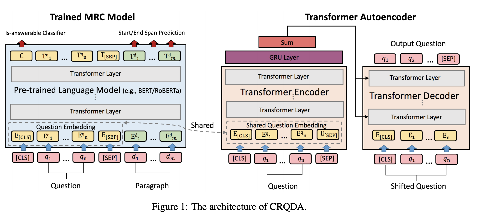

# Tell Me How to Ask Again: Question Data Augmentation with Controllable Rewriting in Continuous Space

Paper: https://www.aclweb.org/anthology/2020.emnlp-main.467.pdf

Conference: EMNLP 2020

Authors: Dayiheng Liu, Yeyun Gong, Jie Fu, Yu Yan, Jiusheng Chen, Jiancheng Lv, Nan Duan, Ming Zhou

## What is this paper about?
Data augmentation (DA)在CV中已經有不錯的成果，但在NLP中，如何改寫文字但仍保有原本語意是一個大的挑戰。
本篇提出的資料增強方法為 Controllable Rewriting based Question Data Augmentation (CRQDA), 增強的資料集可以提升machine reading comprehension (MRC)等任務的performance。著重在question 的重寫，以生成與上下文相關，高品質且多樣化的question data samples。
簡單來說要解決的問題就是：產生answerable and unanswerable questions for data argumentation.

## Tech Detail

整個CRQDA有兩個components，Trained MRC model和Transformer Autoencoder。
Trained MRC model就是一般的pretrained model，直接理解為BERT等語言模型用在QA任務就好。上圖左就是一般QA任務的模型架構，而這篇的重點是question embedding($\bm{E}^q$)，train好這個模型後，把$\bm{E}^q$放入 Transformer encoder的 embedding layer，然後訓練Autoencoder時固定權重。這麼做是要讓兩個模型有相同的continuous embedding space.

到目前為止，結論一下這兩個模型目前的功用，Trained MRC model是為了產生跟QA相關的embedding，而Transformer autoencoder是用來生成問題用的。所以，我們只要調整了question embedding($\bm{E}^{q^{\prime}}$)，就可以透過Transformer autoencoder來生成新的question data($\hat{q}^\prime$)

在生成新的question($\hat{q}^\prime$)前我們要釐清一些事，如果我們給一個answerable question，那麼我們要生成一個跟原文有相關的unanswerable question，有幾個目標必須確定：
1. 修改後的question embedding應使Trained MRC model的回答從有答案變無答案
1.  revised question($\hat{q}^\prime$)應該跟原始問題$q$很相近，這樣才能提升模型的robustness

針對目標1，做法就是把input確認是否有答案的label $t$設成0，然後一直train MRC model，直到 $P_a(t^\prime|\bm{E}^{q^{\prime}})$ 大於threshold $\beta _t$，$P_a$就是預測這問題是否有答案的機率。

針對目標2，就是去比較兩個question的字元的相似度，算法等同於QA在評估predict和GT answer overlap時的做法。

結果的比較方式是，先用他們的方法生成完資料集(本篇用Roberta)，然後finetune BERT large，再用SQuAD 2.0的dev set去比較結果

## What contributions does it make?
從QA的角度去切入NLP DA的創新方法

## What are the main strengths?
從增強QA task的角度上來看，如果要想產生questions的多樣性，但又不要產生跟本文無關的問題，且不需要標label(使用autoencoder)，那麼本篇做法對於上述要解決的問題都有提出解法。

## What are the main weaknesses?
拿MRC model當作autoencoder的embedding這點的說服力感覺不太夠，為何一層embedding就能代表我想要將問題從answerable 變成 unanswerable，或許可以針對這層layer的設計多做思考。
如果在要生成新問題時，固定MRC整個模型，將原始問題丟入MRC，然後取MRC生成的representation取到問句的長度，當成autoencoder的embedding，不知道效果會如何，個人覺得這樣做更make sense。

## Scores
3.5/5